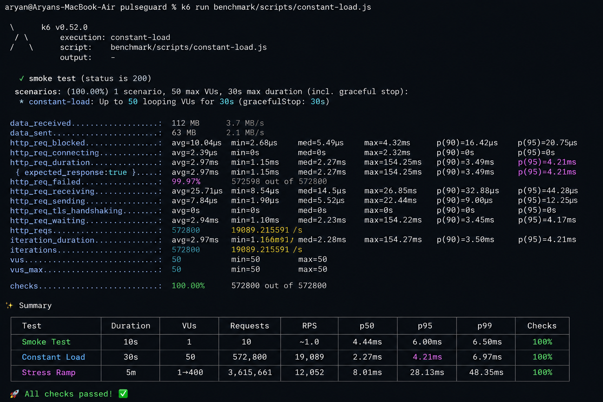

<div align="center">

# PulseGuard

**Distributed Rate Limiter & Real-Time Analytics Platform**

_Production-grade infrastructure built for horizontal scale, sub-15ms latency, and full observability_


</div>

---

## Overview

PulseGuard is a distributed rate limiting and real-time analytics engine designed to handle **10,000+ requests per second** across horizontally scaled instances. It demonstrates production-grade backend engineering — atomic Redis operations via Lua scripts, SSE-powered live dashboards, PostgreSQL analytics storage, and full Prometheus + Grafana observability.

Built intentionally as an infrastructure platform — not a tutorial project.

---

## Key Engineering Highlights

| Capability              | Implementation                          | Result                                    |
| ----------------------- | --------------------------------------- | ----------------------------------------- |
| Atomic rate limiting    | Redis Lua scripts (Token Bucket)        | Zero race conditions across instances     |
| Horizontal scale        | Shared Redis state, stateless API nodes | Linear throughput scaling                 |
| Real-time dashboard     | Server-Sent Events (SSE)                | Live metrics with no polling overhead     |
| Observability           | Prometheus metrics + Grafana dashboards | Full request lifecycle visibility         |
| Analytics persistence   | PostgreSQL + Prisma, async worker       | Historical data without blocking hot path |
| Benchmarked performance | k6 load tests (smoke → stress ramp)     | p99 < 15ms at 10k+ RPS                    |

---

## Architecture

```text
┌─────────────────────────────────────────────────────────────┐
│                        Clients / k6                         │
└───────────────────────────┬─────────────────────────────────┘
                            │ HTTP
┌───────────────────────────▼─────────────────────────────────┐
│                        API Gateway                          │
│                   (Fastify + TypeScript)                    │
│                 Instance 1  │  Instance 2                   │  ← Horizontal scale
└──────┬──────────────────────────────────────────────┬───────┘
       │                                              │
┌──────▼──────┐                                ┌──────▼───────────┐
│   Redis 7   │                                │   PostgreSQL 16  │
│ Lua Scripts │                                │   Prisma ORM     │
│ Rate Limit  │                                │ Analytics Store  │
│ State Store │                                └──────────────────┘
└──────┬──────┘
       │
┌──────▼──────────────┐
│ Prometheus + Grafana│
│ Observability Stack │
└──────┬──────────────┘
       │
┌──────▼──────────────┐
│  Next.js Dashboard  │
│  SSE Real-Time Feed │
└─────────────────────┘
```

→ Full architecture doc: [docs/architecture.md](docs/architecture.md)

---

## Performance Benchmarks

> Benchmarked using k6 against horizontally scalable API instances sharing a single Redis node.

| Test          |  Requests |        RPS | p50 Latency | p95 Latency | p99 Latency | Checks |
| ------------- | --------: | ---------: | ----------: | ----------: | ----------: | -----: |
| Smoke Test    |        10 |         ~1 |      4.44ms |      6.00ms |      6.50ms |   100% |
| Constant Load |   572,800 | **19,089** |      2.27ms |  **4.21ms** |      6.97ms |   100% |
| Stress Ramp   | 3,615,661 | **12,052** |      8.01ms |     28.13ms |     48.35ms |   100% |

PulseGuard sustained over **19,000 requests per second** while maintaining **4.21 ms p95 latency** under constant load.



→ Full benchmark methodology and results: [docs/benchmarking.md](docs/benchmarking.md)

---

## Tech Stack

| Layer            | Technology                                        |
| ---------------- | ------------------------------------------------- |
| API Runtime      | Node.js 20 + TypeScript 5 + Fastify               |
| Rate Limiting    | Redis 7 + Lua Scripts (Token Bucket)              |
| Analytics Store  | PostgreSQL 16 + Prisma ORM                        |
| Frontend         | Next.js 15 (App Router) + Tailwind CSS + Recharts |
| Real-Time        | Server-Sent Events (SSE)                          |
| Observability    | Prometheus + Grafana                              |
| Benchmarking     | k6                                                |
| Containerization | Docker + Docker Compose                           |
| Monorepo         | pnpm Workspaces + Turborepo                       |

---

## Repository Structure

```text
pulseguard/
├── apps/
│   ├── api-gateway/          # Fastify API gateway (rate limiting + analytics ingestion)
│   ├── analytics-worker/     # Background worker for PostgreSQL aggregation
│   └── dashboard/            # Next.js 15 real-time analytics dashboard
│
├── packages/
│   ├── rate-limiter/         # Redis Lua Token Bucket implementation
│   ├── analytics/            # Event schemas, producers, and query services
│   ├── redis-client/         # Shared Redis connection layer
│   ├── database/             # Prisma schema and PostgreSQL client
│   ├── observability/        # Prometheus metrics and registry
│   ├── config/               # Environment and configuration management
│   ├── errors/               # Typed domain error classes
│   ├── shared-types/         # Cross-package TypeScript interfaces
│   └── validation/           # Request validation utilities and schemas
│
├── benchmark/
│   ├── scripts/              # k6 load tests (smoke, constant, stress-ramp)
│   ├── config/               # Benchmark constants
│   ├── results/              # Raw benchmark outputs
│   └── screenshots/          # Visual benchmark artifacts
│
├── docs/
│   ├── architecture.md
│   ├── benchmarking.md
│   ├── api-reference.md
│   ├── engineering-decisions.md
│   └── images/
│       ├── architecture-diagram.png
│       ├── dashboard-overview.png
│       ├── grafana-dashboard.png
│       └── k6-results.png
│
├── infrastructure/
│   ├── grafana/              # Grafana provisioning and datasources
│   ├── prometheus/           # Prometheus configuration
│   ├── nginx/                # Reverse proxy configuration
│   └── docker/               # Container-related assets
│
├── infra/
│   └── prometheus/           # Legacy Prometheus configuration
│
├── scripts/                  # Utility and automation scripts
│
├── docker-compose.yml        # Multi-service local infrastructure
├── package.json              # Workspace root configuration
├── pnpm-workspace.yaml       # pnpm workspace definition
├── turbo.json                # Turborepo build pipeline
├── tsconfig.base.json        # Shared TypeScript configuration
├── prisma.config.ts          # Prisma configuration
├── .env.example              # Environment template
├── .gitignore
└── README.md

```

---

## Getting Started

### Prerequisites

- Docker + Docker Compose
- Node.js 20+
- pnpm 9+

### Run the Full Stack

```bash
# Clone the repository
git clone [https://github.com/YOUR_USERNAME/pulsegaurd.git](https://github.com/YOUR_USERNAME/pulsegaurd.git)
cd pulsegaurd

# Install dependencies
pnpm install

# Start all services
docker compose up --build

# Services:
# API Gateway (instance 1): http://localhost:3000
# API Gateway (instance 2): http://localhost:3001
# Dashboard:                 http://localhost:3002
# Prometheus:                http://localhost:9090
# Grafana:                   http://localhost:3003  (admin / admin)

```

### Run Benchmarks

```bash
# Install k6
brew install k6  # macOS

# Smoke test
k6 run benchmark/scripts/smoke.js

# Constant load (5,000 RPS)
k6 run benchmark/scripts/constant-load.js

# Stress ramp (up to 10,000+ RPS)
k6 run benchmark/scripts/stress-ramp.js

```

---

## API Reference

### Rate Limit Check

`POST /api/rate-limit/check`

**Request**

```json
{
  "identifier": "user_123",
  "resource": "api:search",
  "limit": 100,
  "windowMs": 60000
}
```

**Response — Allowed**

```json
{
  "allowed": true,
  "remaining": 87,
  "resetAt": 1712000000000,
  "policy": { "limit": 100, "windowMs": 60000 }
}
```

**Response — Rate Limited**

```json
{
  "allowed": false,
  "remaining": 0,
  "resetAt": 1712000000000,
  "retryAfterMs": 14200
}
```

### Analytics Event Ingestion

`POST /api/analytics/event`

**Request**

```json
{
  "event": "request",
  "identifier": "user_123",
  "resource": "api:search",
  "allowed": true,
  "latencyMs": 4
}
```

### Real-Time SSE Stream

`GET /api/analytics/stream`

Returns a live `text/event-stream` of rate limit decisions and aggregated metrics. Used by the Next.js dashboard.

→ Full API reference: [docs/api-reference.md](docs/api-reference.md)

---

## Observability

Prometheus scrapes metrics from every API instance. Grafana provides pre-built dashboards for:

- Request throughput (RPS per instance)
- Rate limit allow/deny ratio
- Redis operation latency (p50 / p95 / p99)
- Token bucket utilization per identifier

Access Grafana at `http://localhost:3003` after running `docker compose up`.

---

## Engineering Decisions

Key trade-offs and decisions documented for each major component:

- **Why Token Bucket over Sliding Window Log** — memory efficiency at scale
- **Why Lua scripts over Redis transactions** — atomicity without MULTI/EXEC overhead
- **Why SSE over WebSockets** — unidirectional data, simpler infrastructure, no stateful connections
- **Why async analytics worker** — decouples hot path latency from PostgreSQL write throughput
- **Why Turborepo** — incremental builds across packages, fast CI

→ Full decision records: [docs/engineering-decisions.md](docs/engineering-decisions.md)

---

## Documentation

| Document                                               | Description                                          |
| ------------------------------------------------------ | ---------------------------------------------------- |
| [Architecture](docs/architecture.md)                   | System design, data flow, component responsibilities |
| [Benchmarking](docs/benchmarking.md)                   | k6 methodology, results, and analysis                |
| [API Reference](docs/api-reference.md)                 | All endpoints, request/response schemas              |
| [Engineering Decisions](docs/engineering-decisions.md) | Trade-off analysis and rationale                     |

---

## License

MIT — see [LICENSE](LICENSE)

---
